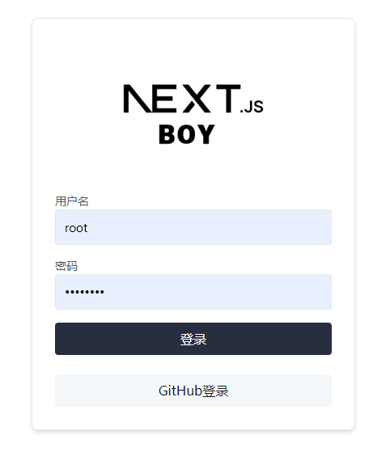
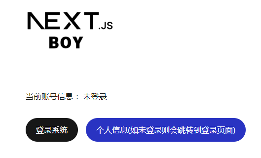

明白了！以下是根据你的大纲扩展后的内容：

## 一起干翻next-auth@5.0系列(四): 快速自定义UI

之前我们掌握并且实践了一些next-auth的基本操作，本文将介绍如何快速自定义UI，并使用next-auth@5.0系列的最新版本。为了保持课程的简洁，我们抛弃复杂性，去除数据库相关功能。

### 1. 调整`auth.ts`配置
在`auth.ts`文件中，我们需要配置`next-auth`以使用自定义的登录页面。增加以下配置项：

```typescript
import NextAuth from 'next-auth';

export const authOptions = {
  pages: {
    signIn: "/signin", // 自定义登录页面
  },
  // 其他配置项...
};

export default NextAuth(authOptions);
```

这段代码将会告诉`next-auth`在需要用户登录时，跳转到我们定义的`/signin`页面。

### 2. 自定义登录页面



#### 登录入口

我们为登录入口创建了一个按钮组件，它会将用户重定向到自定义登录页面。下面是代码示例：

```typescript
import { redirect } from "next/navigation";

export function SignInButton() {
  return (
    <form
      action={async () => {
        "use server";
        await redirect("/signin");
      }}
    >
      <button
        className="rounded-full border border-solid border-transparent transition-colors flex items-center justify-center bg-foreground text-background gap-2 hover:bg-[#383838] dark:hover:bg-[#ccc] text-sm sm:text-base h-10 sm:h-12 px-4 sm:px-5"
        type="submit"
      >
        登录
      </button>
    </form>
  );
}
```

在上述代码中，`redirect("/signin")`会将用户重定向到我们自定义的登录页面。按钮样式使用了Tailwind CSS，你可以根据自己的需求进行调整。

#### 自定义登录页面内容

接下来，我们在`/pages/signin.tsx`中创建自定义的登录页面。页面可以包括输入框、提交按钮和一些简单的样式：

```typescript
import { useState } from 'react';

export default function SignIn() { }
```

这个页面包含了邮箱和密码输入框，还有一个显示错误信息的区域。点击登录按钮时会执行`handleSubmit`函数进行表单提交。

### 3. 需要注意的一些坑

#### 3.1 自定义页面需要自己处理 `callbackUrl` 防止回调错误

当用户成功登录后，`next-auth`会将用户重定向回之前的页面，或者回到我们配置的默认页面。如果你遇到回调错误，请确保正确处理`callbackUrl`，并在登录成功后进行适当的重定向。

#### 3.2 在自动跳转的时候，使用`redirect`，防止官方的奇怪的异常

在自定义页面中使用`redirect`方法来进行页面跳转，这样可以避免`next-auth`内置的重定向机制可能引发的一些异常情况。

### 4. 启动

#### 4.1 安装依赖

确保安装了所有必需的依赖：

```bash
npm install
```

#### 4.2 启动项目

使用以下命令启动开发服务器：

```bash
npm run dev
```



现在你可以访问本地开发服务器，查看并测试自定义的登录页面。

### TODO:
- [ ] 使用数据库管理账户信息，集成注册页面
- [ ] 处理其他`next-auth`功能，如密码重置、邮箱验证等
- [ ] 优化用户体验，添加更多的UI交互效果和状态提示