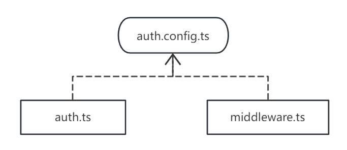
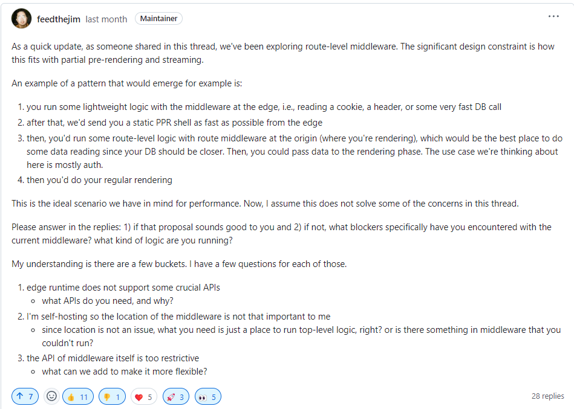

## 一起干翻next-auth@5.0系列(五): 集成数据库搞定注册/登录


## 前言 
终于到完整集成前面课程的时刻了,我们来整理一下本次的需求:

- [x] 集成数据库登录
- [x] 自定义注册页面
- [x] 完成账户注册逻辑

## 前置知识
- 一起干翻next-auth@5.0系列(三): 授权登录集成到数据库
- prisma: 一个成熟的`NodejsOrm`工具
- sqlite: 最简单的基于文件系统的数据库

## 技术点分析
- [x] 使用`prisma`来管理`sqlite`数据库
- [x] 使用`ServerAction`来处理`账户注册逻辑`
- [x] 使用`crypto`模块来实现`Salt`加盐技术,保障账户密码安全


## 1. 引入`prisma`来快速集成数据库

这边其实很简单,一步步按照我们的教程(三)来启动就可以了.
本次我们简单的描述一下步骤:
#### 1.1 安装依赖
```
pnpm add @prisma/client 
pnpm add -D prisma
```


#### 1.2 创建环境变量`DATABASE_URL`
为了简单,我们使用`sqlite`
```
DATABASE_URL="file:temp/dev.db"
```

#### 1.3 创建`prisma/schema.prisma`,并初始化数据库

这边schema.prisma文件内容如下:
```prisma
datasource db {
  provider = "sqlite"
  url      = env("DATABASE_URL")
}
 
generator client {
  provider = "prisma-client-js"
}
 
model User {
  id            String          @id @default(cuid())
  nickname          String?
  username         String?         @unique
  password         String?         
  salt         String?         
  image         String?
  createdAt DateTime @default(now())
  updatedAt DateTime @updatedAt
}
```
> 为了保持简洁,我们的数据库设计非常简单,但是完善.接下来我们直接初始化

```bash
pnpm  prisma migrate dev
```

#### 1.4 配置`PrismaClient`
创建文件`src/prisma.ts`
```typescript
import { PrismaClient } from "@prisma/client"
const globalForPrisma = globalThis as unknown as { prisma: PrismaClient }
export const prisma = globalForPrisma.prisma || new PrismaClient()
if (process.env.NODE_ENV !== "production") globalForPrisma.prisma = prisma
```

## 2. 改造`auth.ts`,让`prisma`适配到`NextAuth`

由于`Nextjs/Middleware`不支持数据库连接,我们来拆分出`auth.config.ts`文件,让它只负责`NextAuth`的配置,而数据库的连接交给`auth.ts`来管理.




#### 2.1 创建 `src/auth.config.ts`
```typescript
import { NextAuthConfig } from "next-auth";

export const AuthConfig:NextAuthConfig = {
  session: {
    strategy: "jwt",
  },
  providers: [],
  pages: {
    signIn: "/signin",
  },
};
```

#### 2.2 修改 `src/auth.ts`

现在 `auth.ts` 只提供`Adapter`的配置,其他配置从`auth.config.ts`中获取.


#### 2.3 改造`middleware/auth.ts`


## 延伸探讨: 为什么又要改造`auth.ts`

> 为什么反复强调这里,因为`nextjs`的恶心机制,导致在`middleware`无法支持数据库连接,所以拆分后,我们可以独立配置数据库相关的配置.

> `Nextjs`恶心的`middleware`无法开启`nodejs runtime`的机制,在社区也有很大的探讨,但是目前暂时没有好的解决方案.我也一直在跟进官方的进度,近期,维护者有提起这个问题,并提出了在`page/route`上建立一套新的`middleware`的方案,但是目前仍然没有进度,后续我会出一篇文章重点讲解一下`nodejs runtime`和`edge runtime`有什么坑.

> [关于middleware的讨论(Switchable Runtime for Middleware (Allow Node.js APIs in Middleware)
)](!https://github.com/vercel/next.js/discussions/46722#discussioncomment-10534577)




### TODO:
- [x] 使用数据库管理账户信息，集成注册页面
- [ ] 整合,打造`Nextjs`的统一账户中心

 